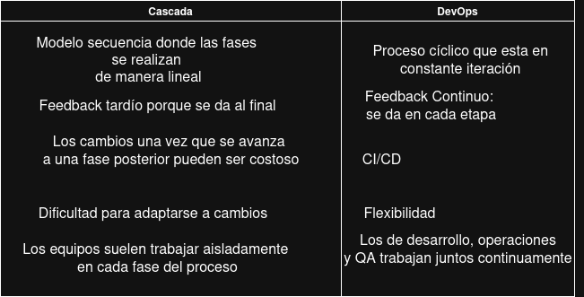

# Actividad 1: Introducción DevOps / DevSecOps
**Autor:** Espinoza Hu. Alan  
**Fecha:** 2025-09-3  
**Tiempo total invertido:** hh:mm

**Entorno usado:**
Ubuntu 22.04 (usuario estándar), navegador Firefox/Chrome, herramientas: draw.io/Excalidraw para diagramas; DevTools para HTTP/TLS; herramienta de DNS; utilidad del sistema para puertos. Sin credenciales.

---

## 4.1 DevOps vs. cascada tradicional

**Síntesis:**  
- **DevOps** acelera por *feedback continuo*, *lotes pequeños* y *automatización* (CI/CD). Reduce riesgo al detectar temprano y lanzar cambios pequeños y reversibles.  
- **Cascada** concentra riesgo: integración tardía, lotes grandes, largos tiempos de espera.

**Contexto donde cascada aún aplica (ejemplo realista):**  
Sistemas con certificaciones regulatorias estrictas o acoplamiento a hardware.  
**Criterios verificables:**  
1) Cambios requieren evidencia de conformidad formal por etapa (p.ej., firma QA/regulatoria por release).  
2) Dependencias de hardware que exigen ventanas de validación > 2 semanas.  
**Trade-off:** +Conformidad y trazabilidad; –Velocidad de entrega y aprendizaje.

**Fuente(s):** ver `FUENTES.md`.

---

## 4.2 Ciclo de dos pasos y silos (limitaciones y anti-patrones)

**Limitaciones sin integración continua:**  
- **Lotes grandes** → integración dolorosa, más fallos agrupados.  
- **Colas de defectos** → feedback tardío y retrabajo.

**Anti-patrones y cómo agravan incidentes:**  
- **Throw over the wall:** handoff sin contexto → asimetrías de información, aumenta **MTTR** por diagnósticos más lentos.  
- **Seguridad como auditoría tardía:** costo de integración de control llega al final → **degradaciones repetitivas** y hotfixes.

---

## 4.3 Principios DevOps (CI/CD, pruebas, colaboración; Agile como precursor)
**CI:** cada cambio se integra y valida cerca del código con pruebas automatizadas; **cambios pequeños** → menos riesgo.  
**CD:** preparación y promoción automática con *gates*.  
**Agile alimenta el pipeline:** *dailies* y *retros* fijan qué promover/bloquear según lo aprendido.

**Indicador observable de colaboración (no financiero):**  
- **Tiempo desde “PR listo” hasta despliegue en pruebas.**  
**Cómo recolectarlo (free):** metadatos del gestor de repos/PR + registros del pipeline (hora PR listo, hora despliegue en test). Calcula medianas semanales.

---

## 4.4 DevSecOps (SAST/DAST + cultura)
**SAST vs DAST:**  
- **SAST:** análisis estático, temprano (antes de ejecutar); encuentra patrones de código inseguros.  
- **DAST:** análisis dinámico, en ejecución; ataca endpoints reales.

**Gate mínimo de seguridad (umbrales):**  
- **SAST:** **0** vulnerabilidades **críticas/altas** (CVSS ≥ **7.0**) antes de promover.  
- **DAST:** **≥ 80%** de cobertura en rutas **críticas** (auth, pagos, etc.).  

**Política de excepción (con caducidad):**  
Excepción de **7 días**, responsable: **Líder técnico**; plan: mitigación (p.ej., WAF/parche) y reescaneo; caduca automáticamente.

**Evitar “teatro de seguridad”:**  
- Disminución de **repetidos** (≤ **5%** de hallazgos recurrentes entre despliegues).  
- **TTR** de vulnerabilidades críticas ≤ **48 h** (detección→corrección).

---

## 4.5 CI/CD y estrategia de despliegue

**Estrategia elegida:** *Canary* para microservicio **de autenticación**: libera a un % pequeño de tráfico, observa KPIs y promueve/abortas.

**Tabla de riesgos vs mitigaciones:**

| Riesgo                              | Mitigación concreta                                               |
|------------------------------------|-------------------------------------------------------------------|
| Regresión funcional                 | **Contratos de API** y tests de compatibilidad antes de promover |
| Coste de infraestructura temporal   | Límite de convivencia (≤ 24 h) y auto-apagado de instancias      |
| Manejo de sesión/esquema           | *Draining* de sesiones y migraciones compatibles hacia adelante   |

**KPI primario del gate:**  
- **Tasa de errores 5xx ≤ 0.1%** en **1 hora** post-despliegue canary.  
**Métrica de producto coexistente:**  
- **Conversión ≥ 95%** del baseline pre-despliegue.  
*Ambas coexisten porque estabilidad técnica ≠ éxito de negocio; un cambio correcto a nivel 5xx puede dañar UX o funnel.*

---

## 4.6 Fundamentos prácticos (evidencia mínima, sin comandos)
1) **HTTP – contrato observable**  
Hallazgo (ejemplo): *Solicitud GET a sitio público*, **200 OK**, cabeceras **Cache-Control: max-age=3600** (mejora caché/rendimiento) y **X-Request-ID: …** (trazabilidad).  
  

2) **DNS – nombres y TTL**  
Hallazgo: *Dominio público con registro* **A** o **CNAME**, **TTL 3600s**. TTL alto → rollbacks más lentos por propagación.  

3) **TLS – seguridad en tránsito**  
Hallazgo: **CN/SAN** visibles, **vigencia** (desde/hasta) y **emisora** (CA). Si no valida cadena → errores de confianza y riesgo **MITM**.  

4) **Puertos – estado de runtime**  
Hallazgo: **dos puertos en escucha** (p.ej., 80/443) y **servicios** asociados. Si 443 no está, despliegue TLS incompleto; si puerto esperado está ocupado, conflicto.  

5) **12-Factor – port binding, config, logs**  
- **Port binding:** parametriza el puerto con **config externa** (variable/archivo de entorno), sin tocar código.  
- **Logs a flujo estándar:** se observan en el runtime (no archivos locales rotados a mano), facilitan *shipping* a agregadores.  
- **Anti-patrón:** credenciales en repositorio → rompe reproducibilidad y complica rotación.

6) **Checklist de diagnóstico (intermitencia) – 6 pasos**

| # | Objetivo | Evidencia esperada | Interpretación | Acción siguiente |
|---|---|---|---|---|
| 1 | Ver si el **contrato HTTP** responde | Código 2xx/4xx/5xx + 2 cabeceras clave | 5xx alto → fallo del backend; falta de cabecera de caché → más carga | Si 5xx>umbral, **abortar/pause** despliegue |
| 2 | Validar **DNS** | Tipo A/CNAME y **TTL** | TTL alto → propagación lenta, usuarios con IP antigua | Si TTL alto y cambios recientes, **esperar ventana** y/o forzar ruta alternativa |
| 3 | Comprobar **TLS** | CN/SAN, vigencia, CA | Caducado o CN no coincide → errores de confianza | **Renovar/ajustar** cert; no promover |
| 4 | Revisar **puertos expuestos** | Puerto del servicio en **LISTEN** | Puerto cerrado → despliegue incompleto; ocupado → conflicto | **Corregir binding** o liberar puerto |
| 5 | Chequear **latencia/errores** canary | p95/5xx en 1 h | Si p95 ↑ o 5xx supera 0.1% | **Rollback** canary |
| 6 | Validar **métrica de producto** | Conversión ≥95% baseline | Si cae conversión con KPIs ok | **Revertir** o **feature toggle** y analizar UX |

---

## 4.7 Desafíos de DevOps y mitigaciones

**Tres riesgos con su mitigación:**  
- **Cultural (silos):** rotaciones Dev↔Ops y *pairing* en incidentes.  
- **Técnico (deuda CI):** *pipelines* reproducibles y tests de contrato.  
- **Gobernanza (controles tardíos):** gates de seguridad **tempranos** (SAST/DAST) con métricas.

**Experimento controlado (despliegue gradual vs big-bang):**  
- **Métrica primaria:** tasa 5xx.  
- **Control:** release big-bang anterior; **Tratamiento:** canary al 10% tráfico.  
- **Criterio de éxito:** 5xx del canary ≤ 50% del big-bang (misma ventana/volumen).  
- **Reversión:** rollback automático si KPI o conversión rompe umbral.

---

## 4.8 Arquitectura mínima DevSecOps (HTTP/DNS/TLS + 12-Factor)

**Flujo:** *Cliente → DNS → Servicio (HTTP) → TLS*.  
**Controles ubicados:**  
- **DNS:** TTL alineado a estrategia de rollback.  
- **HTTP:** contratos de API + caché controlada.  
- **TLS:** validación de cadena, rotación de certificados.  
**12-Factor relacionados:**  
- **Config por entorno:** diffs mínimos entre dev/test/prod (docente puede revisar variables listadas).  
- **Logs a stdout:** trazabilidad de request-id desde canary a producción.

---

## Tabla de evidencias incluidas
- HTTP: método, estado, **2 cabeceras** (captura con recuadros).  
- DNS: tipo A/CNAME y **TTL** destacado.  
- TLS: **CN/SAN**, **vigencia**, **emisora**.  
- Puertos: **2 en escucha** y servicio sugerido.  
- Gates/KPIs: **umbrales + ventana** claramente escritos.  
- Checklist de incidente con **decisiones** (promover/observar/revertir).

---

## Commits realizados
- `Estructura de actividad 1`  
- `Evidencias HTTP/DNS/TLS`  
- `Estrategias de despliegue`  
- `Entrega actividad 1`
