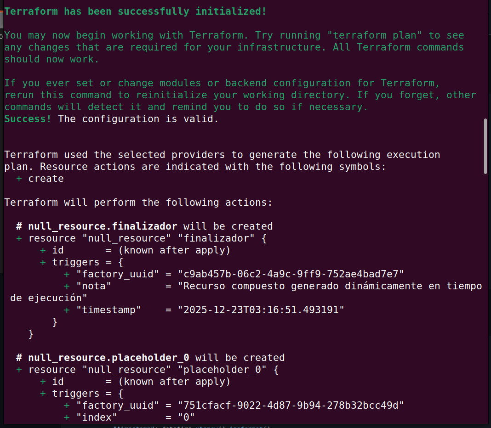
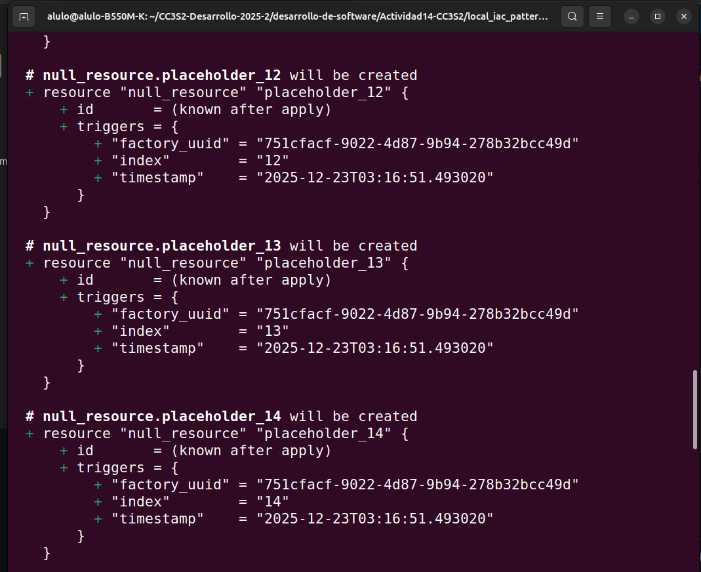
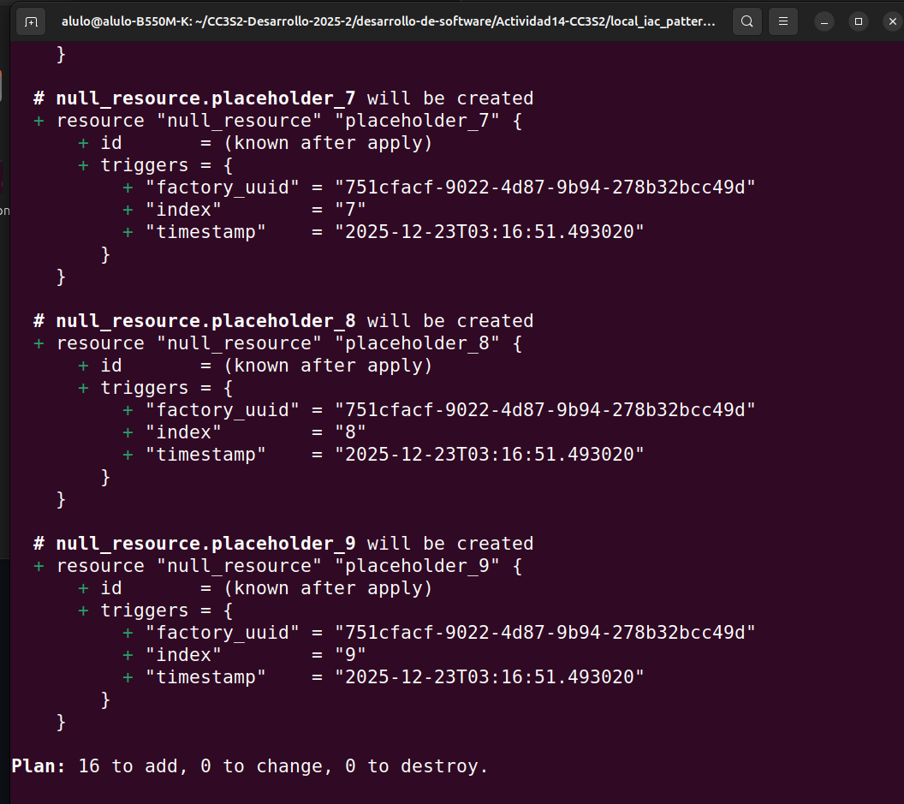
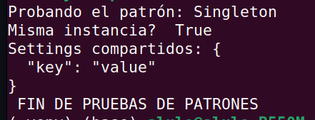

# Actividad 14 – Local IaC Patterns (Terraform JSON)

## Objetivo
Demostrar patrones de diseño (Singleton, Factory, Prototype, Composite, Builder) para generar configuraciones Terraform **locales** (null_resource + local_file) en formato **.tf.json**, con evidencias de ejecución.

## Estructura
- `Actividad14-CC3S2/local_iac_patterns/`: código Python (`iac_patterns/`)
- `Actividad14-CC3S2/Fase2/`: evidencias por ejercicio (logs + terraform json)

## Requisitos
- Python 3.x
- Terraform (probado con provider `hashicorp/null` y `hashicorp/local` cuando aplica)
- Entorno virtual: `Actividad14-CC3S2/.venv/` (opcional)

## Cómo reproducir (rápido)
Ejecutar desde:
`Actividad14-CC3S2/local_iac_patterns/`

Ejemplo:
```bash
python - <<'PY'
from iac_patterns.factory import NullResourceFactory
print(NullResourceFactory.create("demo"))
PY











