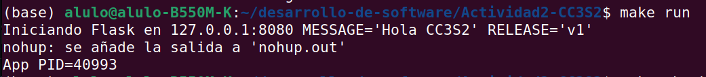
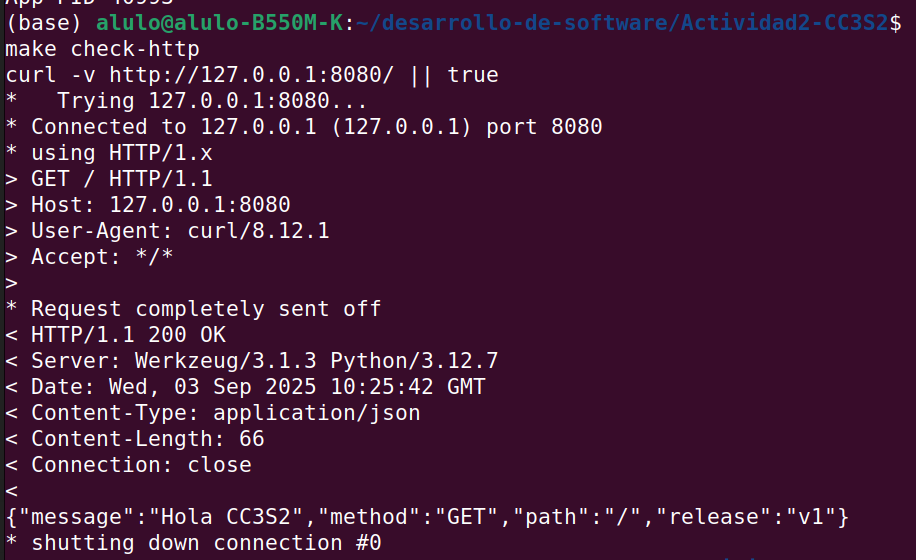
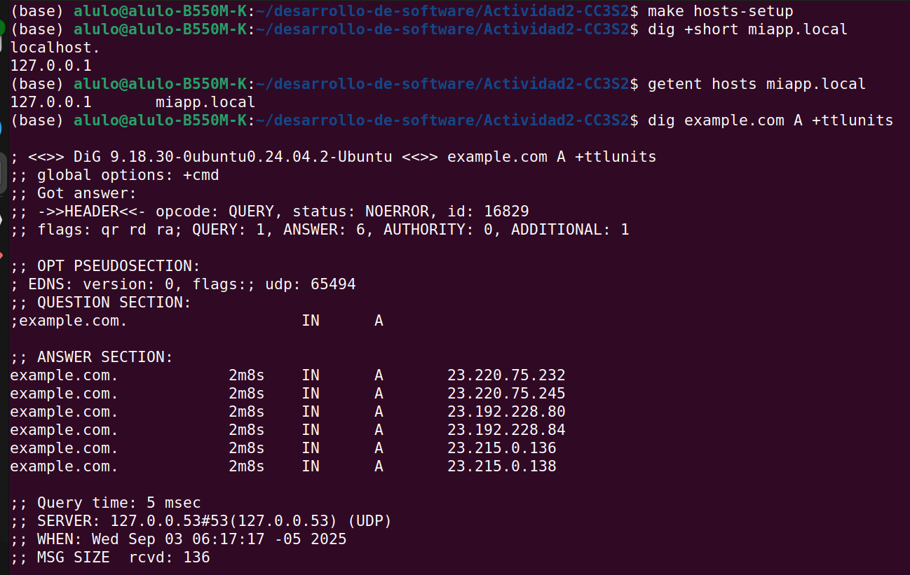
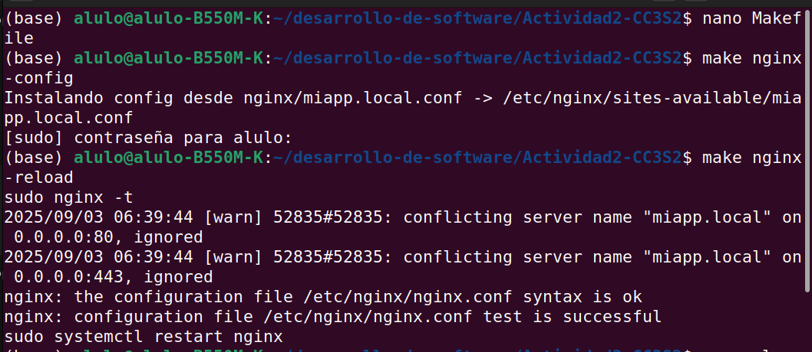
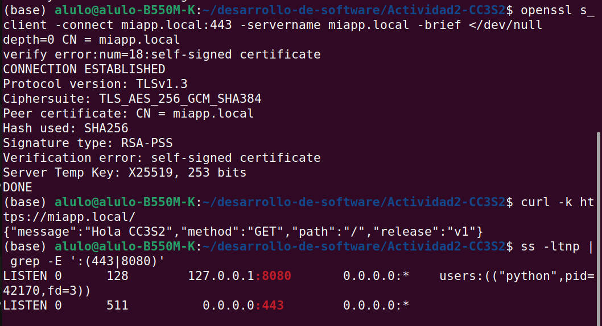
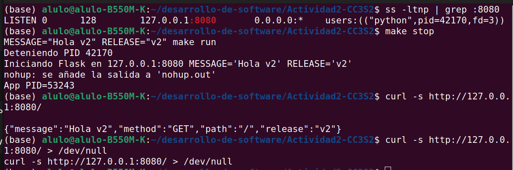

Se busca desplegar una app mínima con buenas prácticas 12-Factor, observando:

HTTP (métodos, códigos, cabeceras, anatomía de petición/respuesta).

DNS (resolución local con /etc/hosts, TTL y caché).

TLS (cifrado en tránsito) con Nginx como reverse proxy (terminación TLS).

12-Factor (port binding, config por entorno, logs a stdout).

Reproducibilidad con Makefile.


## 1) HTTP

* **Ejecución app**:


  ```
La app inicia en el puerto 8080 con el mensaje configurado por entorno.

* **curl - GET**:



Código 200 OK, devuelve JSON con message y release.


---

## 2) DNS



## 3) TLS + Nginx

* **Certificado**:

  ```
  make tls-cert
  ```

  > Menciona SAN=miapp.local y carpeta `/etc/nginx/certs/`.

* problema de heredoc en Makefiles. como solucionarlo? En nginx-config
nginx-config:
	@echo "Instalando config desde nginx/miapp.local.conf -> $(SITE_AV)"
	@sudo install -Dm644 nginx/miapp.local.conf $(SITE_AV)
	@sudo ln -sf $(SITE_AV) $(SITE_EN)

install -Dm644 crea el directorio si no existe y pone permisos 0644.

* **Config Nginx**:

  ```
  make nginx-install
  make nginx-config
  make nginx-reload
  ```




TLS: cifra el tráfico cliente-servidor y autentica al servidor (certificado).

Nginx reverse proxy: escucha en :443, termina TLS y proxyea a Flask en 127.0.0.1:8080.

Lo que demuestras:

Que el cliente entra por HTTPS (miapp.local:443).

Que el cert (autofirmado) permite observar el handshake con openssl.

Que Nginx y Flask están vivos (sockets en :443 y :8080, respectivamente).

Que puedes ver logs de Nginx para diagnosticar (errores de cert, reload, etc.).

* **Handshake/cliente**:

  ```
  openssl s_client -connect miapp.local:443 -servername miapp.local -brief
  curl -k https://miapp.local/
  ```

  > Explica `-k`: ignora validación de CA porque el cert es **autofirmado**.

* **Puertos y logs**:

  ```
  ss -ltnp | grep -E ':(443|8080)'
  journalctl -u nginx -n 50 --no-pager
  ```


---

## 4) 12-Factor App



* **Port binding:** evidencia `ss` de que escucha en `PORT`.

* **Config por entorno:** ejecuta dos veces con distintos `MESSAGE`/`RELEASE`

  ```
  make stop
  MESSAGE="Hola v2" RELEASE="v2" make run
  curl -s http://127.0.0.1:8080/
  ```

  > Muestra JSON cambiando `message` y `release`.

* **Logs a stdout:** redirige con pipeline:

  ```
  PORT=8080 MESSAGE="Hola" RELEASE="v1" python3 app.py | tee app.log
  ```

  > Pega 5 líneas. Explica por qué **no** configuramos “log file” en la app: en 12-Factor, los logs son un **stream** consumido por el entorno (systemd, Docker, etc.).

---

## 5) Operación reproducible (Make/WSL/Linux)

* **Tabla “Comando y Resultado esperado”** :

| Comando                                   | Resultado esperado                    |
| ----------------------------------------- | ------------------------------------- |
| `make prepare`                            | venv creado e instalación de Flask    |
| `make run`                                | app en background, `app.pid` presente |
| `make check-http`                         | 200 y JSON con `message`/`release`    |
| `make hosts-setup`                        | entrada en `/etc/hosts`               |
| `make tls-cert`                           | claves en `/etc/nginx/certs/`         |
| `make nginx-config` + `make nginx-reload` | sitio habilitado, `nginx -t` OK       |
| `make check-tls`                          | `TLSv1.2/1.3` y `curl -k` funciona    |
| `make ss`                                 | sockets en `:8080` y `:443`           |


---


1. **HTTP (idempotencia):**

* **GET, PUT, DELETE** son **idempotentes** por definición HTTP: repetirlos N veces produce el **mismo efecto** del primer intento (ideal para *retries*/health checks).
* **POST** **no** es idempotente (puede crear múltiples recursos).
* Ejemplos:

  * `curl -X PUT http://…/recurso -d '{"x":1}'` → repetir no debería cambiar más el estado.
  * `curl -X POST http://…/items -d '{"x":1}'` → podría **crear** nuevos items cada vez.

2. **DNS (hosts vs producción, TTL):**

* `hosts` sirve para **pruebas locales**. En producción, necesitas DNS autoritativo, HA, propagación y control de TTL.
* **TTL** alto reduce latencia y carga (más cache), pero ralentiza la **propagación** de cambios.

3. **TLS (SNI):**

* **SNI** (Server Name Indication) permite al cliente indicar el **nombre** (miapp.local) en el *handshake* para que el servidor elija el **cert correcto** (multi-sitio).
* Lo demuestras con `openssl s_client -servername miapp.local` (verás el `servername` y la cadena negociada).

4. **12-Factor (logs y config por entorno):**

* **Logs a stdout**: facilitan contenedores/CI/CD porque el **orquestador** recopila/rota/centraliza (no escribes ni rotas archivos desde la app).
* **Config por entorno**: evita hardcodear secretos/puertos; puedes promover el mismo build entre entornos cambiando solo variables.

5. **Operación (ss vs curl, triangulación):**

* `curl` te dice si el **servicio HTTP** responde;
* `ss -ltnp` te muestra **si hay sockets abiertos** y **qué proceso** los posee (útil cuando `curl` falla).
* Con `journalctl`/logs de Nginx ves errores de proxy, permisos, certs, etc. → así triangulas capa por capa.

---

# Mejora incremental 

* **Logs JSON por línea** (más “parseables”):

  ```python
  import json
  logger.info(json.dumps({"event":"request","method":request.method,"path":request.path}))
  ```

  Luego: `journalctl -u nginx -o json` o `jq` para filtrar.

* **Target end-to-end**: crea un `make demo` que llame internamente a `prepare -> run -> tls-cert -> nginx-config -> nginx-reload -> check-http -> check-tls`.

* **systemd**: si quieres, crea `/etc/systemd/system/miapp.service` para la app (ExecStart con tu venv), y muestra `systemctl status miapp` + `journalctl -u miapp`.

