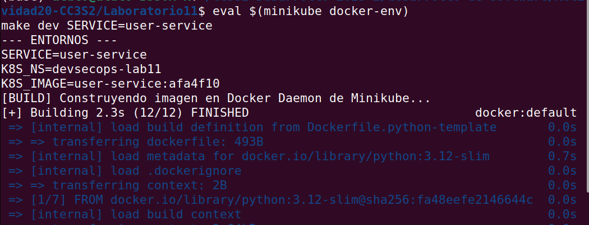
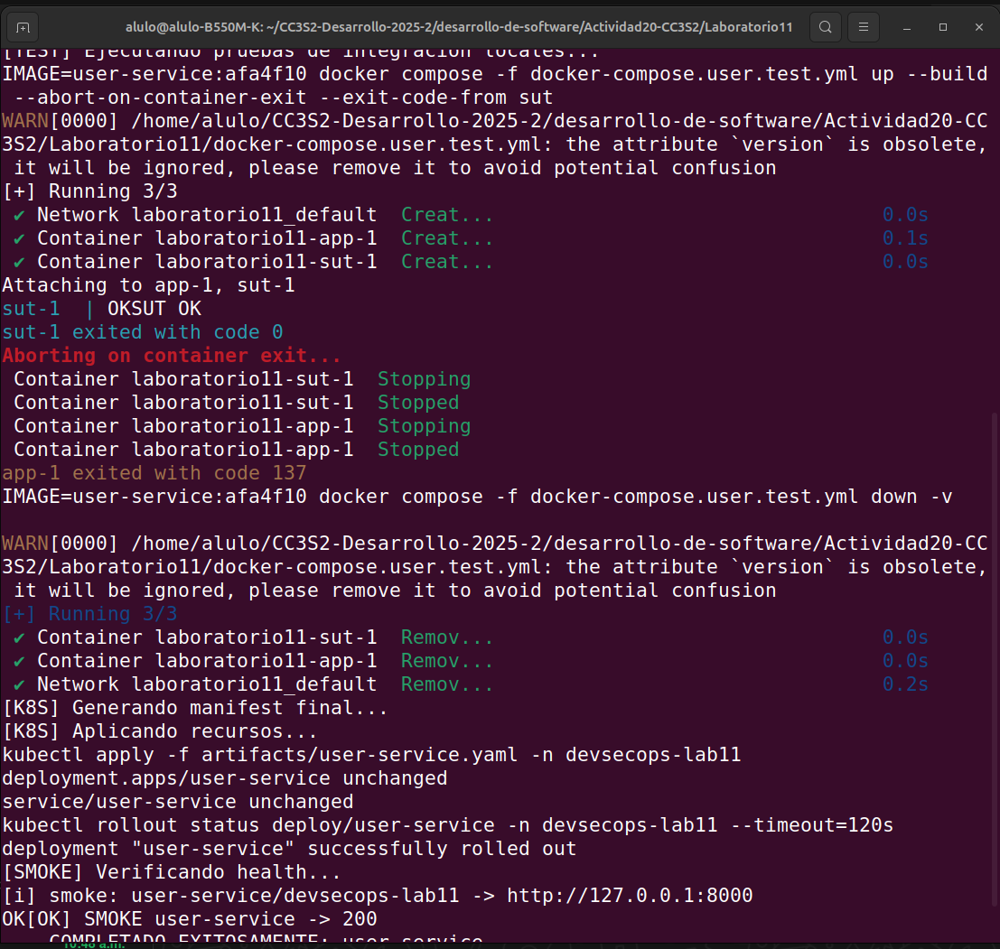
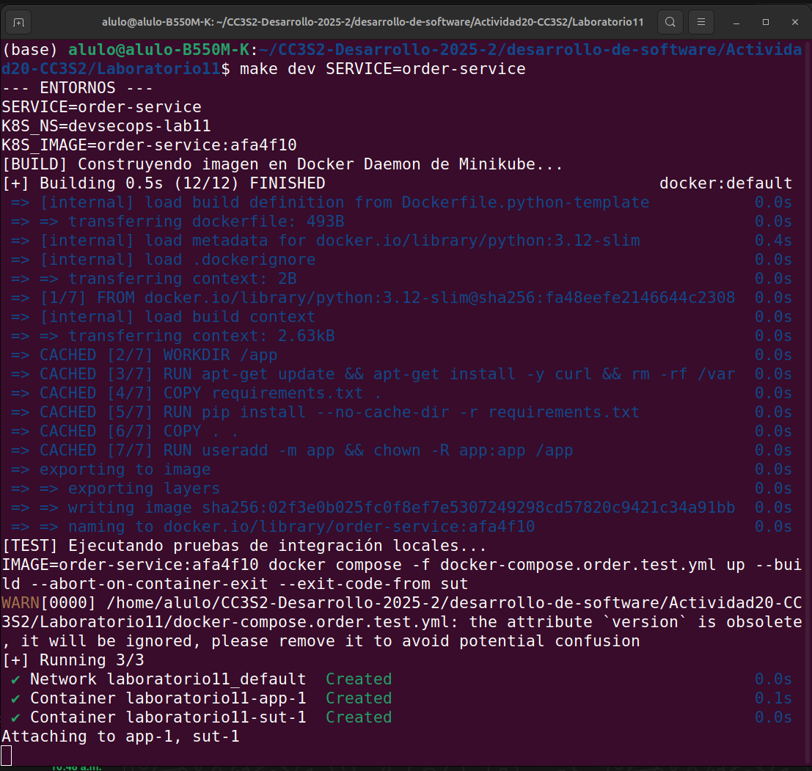
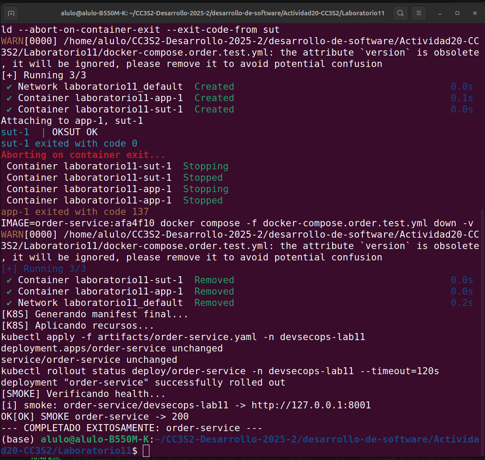
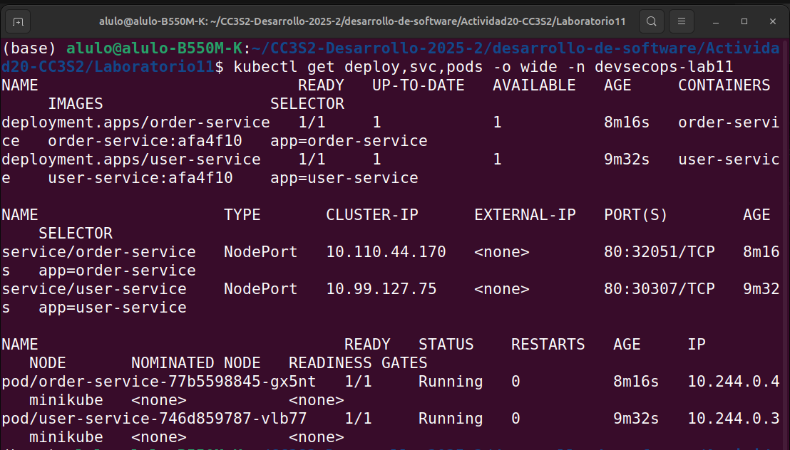

# Actividad 20: DevOps Local-First con Kubernetes (Minikube)

## 1. Descripción del Proyecto
Este proyecto implementa un flujo de trabajo **DevSecOps completo y local** para dos microservicios (`user-service` y `order-service`). El objetivo principal fue eliminar la dependencia de registros de contenedores externos (como Docker Hub o GitHub Packages) y nubes públicas, optimizando el ciclo de desarrollo "inner-loop" utilizando **Minikube** y **Docker Compose**.

El sistema garantiza que cualquier cambio en el código pase por una validación estricta local (Build -> Test -> Deploy) antes de considerarse listo.

## 2. Arquitectura de la Solución Local

La infraestructura se basa en la premisa **"Local First"**, lograda mediante la siguiente estrategia:

1.  **Motor de Contenedores Compartido**: Se configuró el cliente de Docker local para comunicarse directamente con el Docker Daemon de Minikube. Esto evita tener que hacer `docker push` a internet y luego `docker pull` desde el clúster.
2.  **Orquestación Híbrida**:
    * **Docker Compose**: Se utiliza exclusivamente para **pruebas de integración rápidas** (fase `test`), validando la salud del contenedor y sus dependencias de red aisladas.
    * **Kubernetes (Minikube)**: Se utiliza para el despliegue final (fase `ops`), simulando un entorno de producción real con gestión de pods, servicios y namespaces.

## 3. Mejoras Técnicas Implementadas

Se modificaron los manifiestos y scripts originales para cumplir con estándares de seguridad y operabilidad (Hardening).

### A. Endurecimiento de Kubernetes (K8s Hardening)
Se actualizaron los archivos `deployment-and-service.yaml` para incluir:

* **Security Context (Seguridad):** Se forzó la ejecución del contenedor como usuario no-root (UID 1000). Esto mitiga riesgos si un atacante logra escapar del contenedor, ya que no tendría privilegios de root en el nodo host.
    ```yaml
    securityContext:
      runAsNonRoot: true
      runAsUser: 1000
    ```
* **Probes (Disponibilidad):** Se configuraron sondas para que Kubernetes sepa cuándo reiniciar un pod bloqueado (`liveness`) y cuándo enviarle tráfico (`readiness`).
* **Resource Limits (Estabilidad):** Se definieron límites de CPU y Memoria para evitar que un servicio sature el nodo de desarrollo.

### B. Pipeline de Automatización (Makefile)
Se reescribió el `Makefile` para orquestar el flujo sin intervención manual. El comando `make dev` ejecuta secuencialmente:

1.  **Env**: Carga variables de entorno y tags de versión.
2.  **Build**: Construye la imagen DENTRO de Minikube (evitando transferencias de red).
3.  **Test**: Levanta un entorno efímero con Docker Compose, ejecuta un contenedor de pruebas (`sut`) que hace peticiones HTTP con `curl`, y si pasa, destruye el entorno.
4.  **K8s-Prepare**: Inyecta dinámicamente el Tag de la imagen en los manifiestos YAML.
5.  **K8s-Apply**: Despliega en el namespace `devsecops-lab11` y espera el rollout.
6.  **Smoke**: Ejecuta un script final de validación de puertos.

### C. Corrección de Imagen Base (Dockerfile)
Se detectó que la imagen `python:3.12-slim` no incluye `curl`, herramienta crítica para los healthchecks definidos en `docker-compose.yml`.

**Solución aplicada:**
Se modificó el `Dockerfile` para instalar `curl` antes de cambiar al usuario no-root:
```dockerfile
RUN apt-get update && apt-get install -y curl && rm -rf /var/lib/apt/lists/*


Aquí tienes la **Parte 2** del documento. Esta sección se enfoca en la ejecución práctica y, lo más importante, en la sección de **"Resolución de Problemas"**, que demuestra tu aprendizaje y capacidad de ingeniería para superar obstáculos.

Copia esto a continuación de la Parte 1 en tu `README.md`.

---

# Parte 2: Ejecución, Solución de Problemas y Evidencias

## 4. Guía de Ejecución Paso a Paso

Para replicar el despliegue completo en un entorno limpio, seguir estos pasos desde el directorio `Laboratorio11`:

### 4.1 Preparación del Entorno

Es vital conectar la terminal actual con el daemon de Docker interno de Minikube. Esto permite que Kubernetes "vea" las imágenes que construimos localmente sin necesidad de subirlas a internet.

```bash
# Conectar cliente Docker al host de Minikube
eval $(minikube docker-env)

```

### 4.2 Despliegue de Servicios (Pipeline Automatizado)

Ejecutamos el pipeline completo (`build` -> `test` -> `deploy`) para cada microservicio utilizando el `Makefile` optimizado.

**User Service:**

```bash
make dev SERVICE=user-service

```

*Resultado esperado:* Logs de construcción, mensaje `SUT OK` (pruebas pasaron) y finalmente `[SMOKE] OK: user-service is healthy`.

**Order Service:**

```bash
make dev SERVICE=order-service

```

*Resultado esperado:* Despliegue exitoso en el puerto 8001.

### 4.3 Verificación del Estado del Clúster

Para confirmar que los pods están corriendo y las réplicas están listas:

```bash
kubectl get deploy,svc,pods -o wide -n devsecops-lab11

```

---

## 5. Resolución de Problemas (Troubleshooting)

Durante el desarrollo de la actividad se encontraron y resolvieron los siguientes desafíos técnicos:

### Problema A: "ImagePullBackOff" o Imagen no encontrada

* **Síntoma:** Kubernetes intentaba descargar la imagen de internet y fallaba, ignorando la imagen construida localmente.
* **Causa:** "Split-Brain" de Docker. Mi terminal estaba construyendo la imagen en el Docker del host (mi PC), pero Minikube tiene su propio Docker Daemon aislado. Minikube no tenía acceso a la imagen construida.
* **Solución:** Se ejecutó `eval $(minikube docker-env)`. Esto configura las variables de entorno (`DOCKER_HOST`, `DOCKER_CERT_PATH`) para que mi cliente local de Docker envíe las instrucciones de construcción directamente a la VM de Minikube.

### Problema B: Fallo en Healthcheck de Docker Compose

* **Síntoma:** Durante la fase `make test`, el contenedor se marcaba como `unhealthy` y el test fallaba, aunque la aplicación Python iniciaba correctamente.
* **Causa:** El `docker-compose.user.test.yml` define un healthcheck usando el comando `curl`. Sin embargo, la imagen base seleccionada (`python:3.12-slim`) es una imagen minimalista que **no incluye curl** instalado por defecto.
* **Solución:** Se parcheó el `docker/Dockerfile.python-template` agregando la instalación explícita de dependencias:
```dockerfile
# FIX: Instalar curl para healthchecks
RUN apt-get update && apt-get install -y curl && rm -rf /var/lib/apt/lists/*

```


### Problema C: Permisos de Docker Socket

* **Síntoma:** Error `permission denied while trying to connect to the Docker daemon socket`.
* **Solución:** Se agregó el usuario actual al grupo de docker (`sudo usermod -aG docker $USER`) y se refrescó la sesión (`newgrp docker`), permitiendo la gestión del daemon sin privilegios de root (sudo).

---

### Conclusión

La actividad demuestra con éxito cómo orquestar un ciclo de vida de desarrollo seguro y eficiente en un entorno local, cumpliendo con principios de DevSecOps antes de siquiera tocar un entorno de nube compartido.

## Evidencias
Los logs de ejecución y validación se encuentran en la carpeta `evidencia/`.


## capturas de las salidas de los comandos de ejecucion en terminal 

eval $(minikube docker-env)
make dev SERVICE=user-service

salida de terminal:  
  
  

make dev SERVICE=order-service




kubectl get deploy,svc,pods -o wide -n devsecops-lab11



